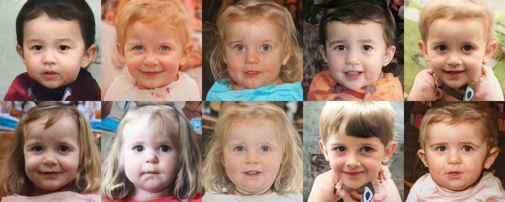

# [Few-shot cross-domain image generation via inference-time latent-code learning](https://openreview.net/pdf?id=sCYXJr3QJM8)

Arnab Kumar Mondal, Piyush Tiwary, Parag Singla & Prathosh AP

*ICLR 2023*



This folder provides a re-implementation of this paper in PyTorch, developed as part of the course METU CENG 796 - Deep Generative Models. The re-implementation is provided by:

Erce Güder, guder.erce@metu.edu.tr\
Adnan Harun Doğan, adnan.dogan@metu.edu.tr

Please see the jupyter notebook file [main.ipynb](main.ipynb) for a summary of paper, the implementation notes and our experimental results.

## Installation

The conda environment can be created using the code snippet below:
```
conda env create -f environment.yml
conda activate 796
```

The following datasets:
- [FFHQ-Sunglasses](https://drive.google.com/u/0/uc?id=1Uu5y_y8Rjxbj2VEzvT3aBHyn4pltFgyX&export=download)
- [FFHQ-Babies](https://drive.google.com/u/0/uc?id=1JmjKBq_wylJmpCQ2OWNMy211NFJhHHID)
- [Bitmoji-faces](https://kaggle.com/datasets/mostafamozafari/bitmoji-face)
- [Sketches](http://mmlab.ie.cuhk.edu.hk/archive/sketchdatabase/CUHK/training_88/Cropped_Images/CUHK_training_cropped_sketches.zip)

as well as the weights of StyleGAN2 trained on FFHQ ([drive](https://drive.google.com/u/0/uc?id=1PQutd-JboOCOZqmd95XWxWrO8gGEvRcO)) can be downloaded via:
```
bash download_data.sh
```
